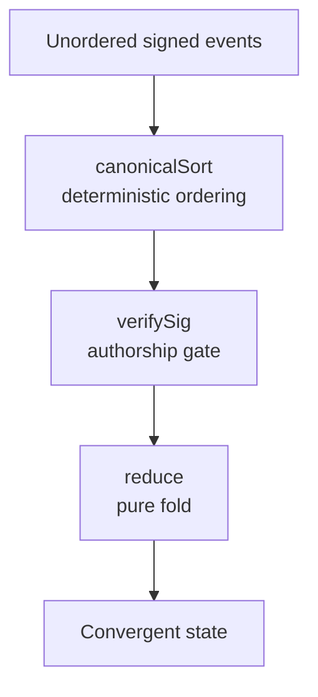

# nostr-desm

Reference implementation of a **Deterministic Event-Driven State Machine (DESM)** primitive.

## What This Proves

This repository demonstrates that deterministic, replayable application state can be derived entirely from unordered signed event streams using pure reduction. Canonical ordering guarantees consistent replay, injected signature verification gates authorship, and a simple fold produces convergent state.

The included profile-state example validates these properties in isolation, without reliance on servers, databases, network ordering, or protocol changes.



## Scope

This repository validates deterministic state reconstruction from signed event streams via canonical ordering and pure reduction.

## Quick Start

```bash
# Install dependencies
npm install

# Run tests
npm test

# Run profile-state example
npm run example:profile
```

Expected output from the example:

```text
Sorted IDs: [ 'root1', 'update1', 'update2' ]
Final state: { name: 'Alice Updated', bio: 'Final Bio' }
```

## API

### `canonicalSort(events: DesmEvent[]): DesmEvent[]`

Deterministic ordering: `created_at` ASC → `id` ASC → insertion index ASC.

### `reduce(events: DesmEvent[], opts: ReduceOptions): Record<string, any>`

State reconstruction via canonical sort + signature verification + fold.

**Options:**
- `verifySig: (event: DesmEvent) => boolean` — **Required.** Inject your signature verifier (tests use a stub).
- `updateKind?: number` — Filter update events by kind (optional).

### `replay(events: DesmEvent[], opts: ReduceOptions): Record<string, any>`

Convenience wrapper. Equivalent to `reduce()`.

## Project Structure

```
src/
├── types.ts    # DesmEvent interface
├── order.ts    # canonicalSort implementation
└── index.ts    # reduce/replay exports

examples/
└── profile-state/
    ├── events.json   # Sample event stream
    └── replay.ts     # Example runner

tests/
└── index.test.ts    # Determinism, auth, tie-break tests

docs/
├── 1 - MASTER_INDEX.md   # Scope and decision ledger
├── 2 - DESM_SPEC.md      # DESM specification
└── 3 - NOSTR_CONTEXT.md  # Protocol background
```

## License

MIT
